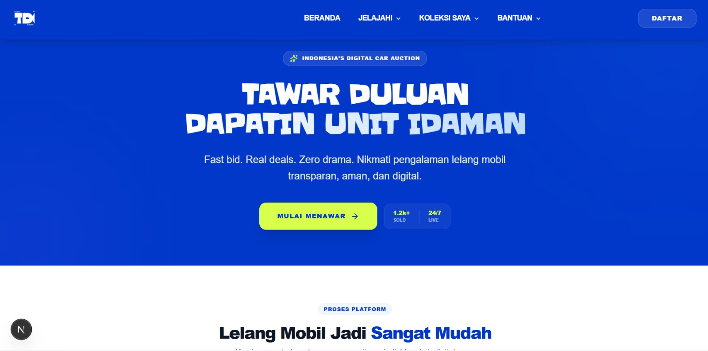
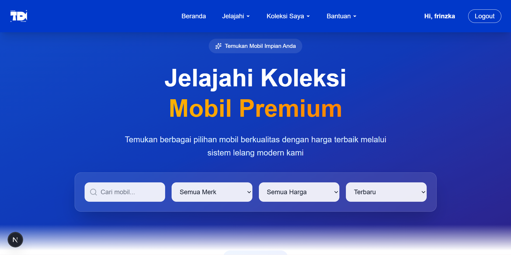
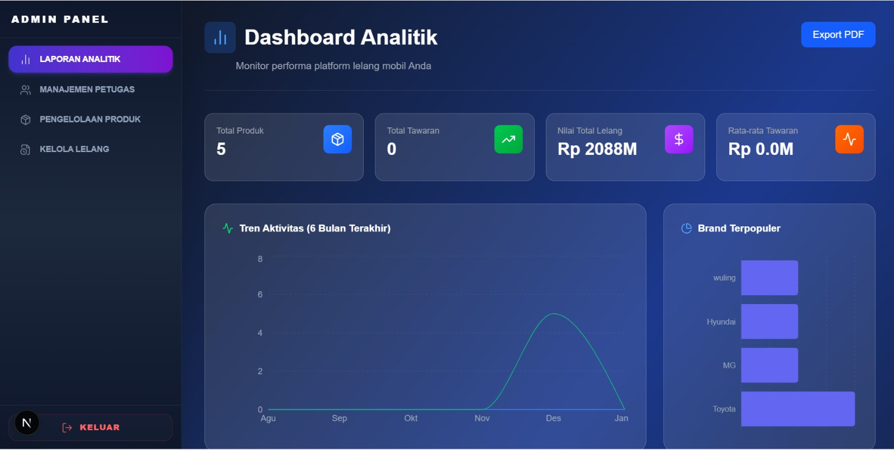

# Tawar Duluan - Platform Lelang Mobil Online

**Tawar Duluan** adalah platform lelang mobil modern yang memungkinkan pengguna mencari, menawar, dan mendapatkan mobil impian dengan harga kompetitif secara transparan dan aman.

## 📸 Galeri Aplikasi

Berikut adalah tampilan antarmuka dari aplikasi Tawar Duluan.

| Halaman | Preview |
| :--- | :--- |
| **Landing Page** <br> Tampilan utama yang menyambut pengguna dengan fitur unggulan. |  |
| **Halaman Jelajahi** <br> Katalog mobil dengan fitur pencarian dan filter lengkap. |  |
| **List Mobil** <br> Informasi lengkap mobil dan formulir penawaran. |  |
| **Detail Mobil** <br> Informasi lengkap mobil dan formulir penawaran. |  |
| **Dashboard Admin** <br> Halaman dashboard admin untuk mengelola data mobil dan lelang. |  |

---

## 🚀 Fitur Unggulan

- **Sistem Lelang Real-time**: Ajukan tawaran dan pantau status lelang secara langsung.
- **Pencarian Canggih**: Filter mobil berdasarkan merk, harga, dan kategori (Ramai, Baru Masuk, dll).
- **Watchlist**: Simpan mobil favorit Anda untuk dipantau nanti.
- **Responsif Modern**: Desain antarmuka yang elegan dan responsif untuk semua perangkat.

## 🛠️ Teknologi yang Digunakan

- **Framework**: [Next.js 15](https://nextjs.org/) (App Directory)
- **Styling**: [Tailwind CSS](https://tailwindcss.com/)
- **Database**: PostgreSQL dengan [Prisma ORM](https://www.prisma.io/)
- **Auth**: NextAuth.js (Custom Credential & OAuth)
- **Icons**: Lucide React

## 📦 Cara Menjalankan Project

1. **Clone repository**
   ```bash
   git clone https://github.com/Frinzkaaa/tawar-duluan.git
   cd tawar-duluan
   ```

2. **Install dependencies**
   ```bash
   npm install
   ```

3. **Setup Database**
   Pastikan file `.env` sudah dikonfigurasi dengan database URL Anda.
   ```bash
   npx prisma generate
   npx prisma db push
   ```

4. **Jalankan Server Development**
   ```bash
   npm run dev
   ```

5. Buka [http://localhost:3000](http://localhost:3000) di browser Anda.

---
© 2025 Tawar Duluan. All rights reserved.
